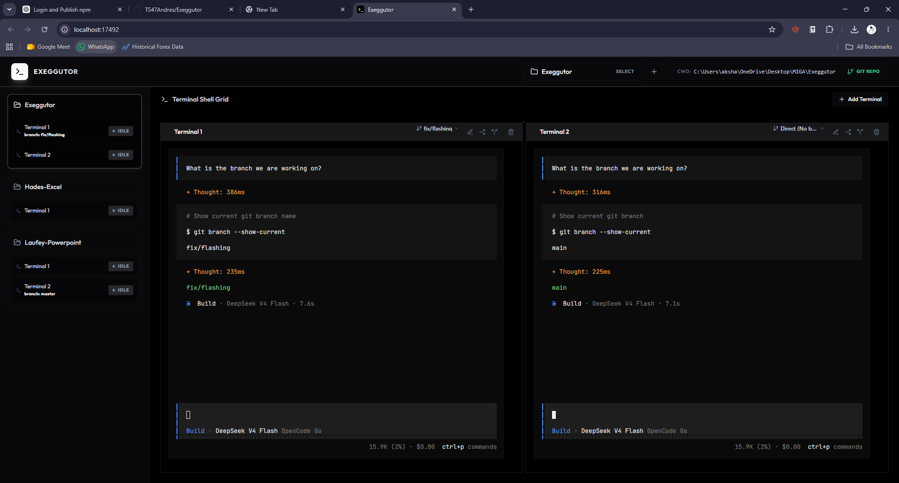
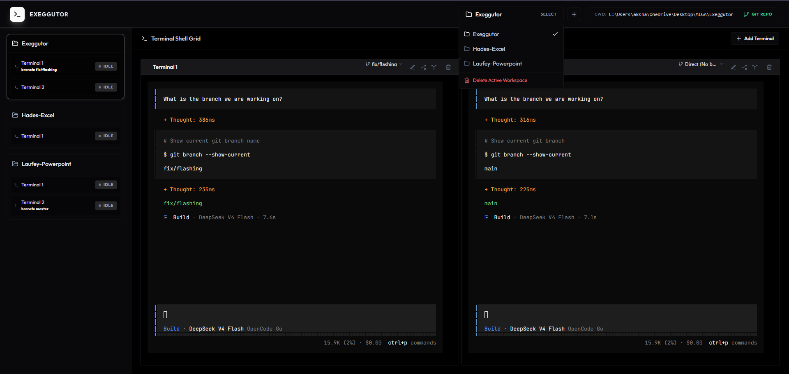
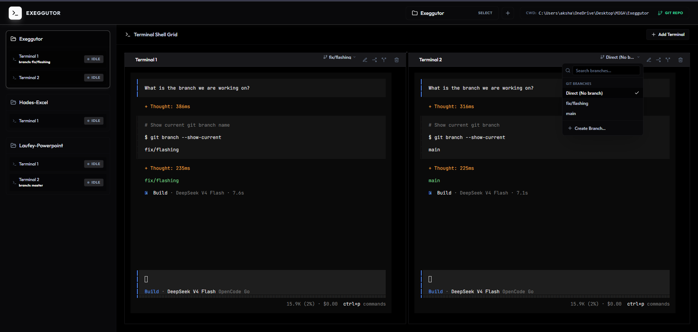
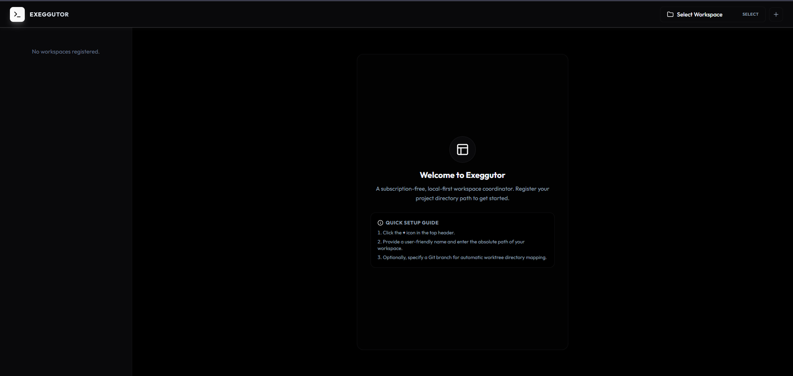
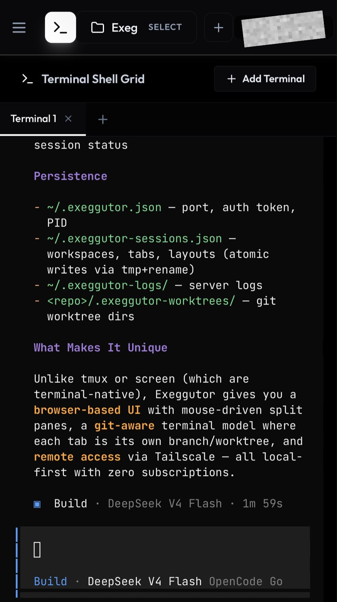

<p align="center">
  
</p>

<p align="center">
  <strong>Exeggutor</strong> — <em>Terminal Multiplexer & Git Worktree Manager</em><br>
  Local-first, subscription-free workspace orchestration dashboard.
</p>

<p align="center">
  
  
  
  
</p>

---

## Features

| | |
|---|---|
| **Multi-Workspace Engine** | Switch projects and automatically swap terminal grids, paths, and configurations. |
| **Tabbed Terminal Grid** | Spawn unlimited terminals, split horizontally/vertically, persist sessions across restarts. |
| **Observer Sidebar** | Real-time terminal state monitoring (Active, Waiting, Idle, Errored) with live text previews. |
| **Git Worktree Isolation** | Run terminals inside branch-isolated worktree folders — no checkout overhead, no conflicts. |
| **Remote Access** | Expose the dashboard over your Tailscale tailnet via `--tailscale` flag. |
| **Persistent State** | Workspaces, terminals, and layouts survive server restarts and package upgrades. |

---

## Screenshots

### Workspace Management

<p align="center">
  
</p>

Switch between registered workspaces, each with its own terminal grid, path mapping, and branch configuration.

### Git Branch Selector

<p align="center">
  
</p>

Create and switch branches per-terminal. New branches automatically spin up an isolated git worktree — zero context switching.

### Zero-State Onboarding

<p align="center">
  
</p>

A clean welcome screen guides you through registering your first workspace and getting started in seconds.

### Mobile View

<p align="center">
  
</p>

Responsive layout with a slide-out sidebar drawer and single-terminal tabbed view for on-the-go access.

---

## Architecture

```
┌──────────────────────────────────────────────────────┐
│                   Exeggutor CLI                        │
│  (bin/exeggutor.js — server lifecycle, flags, tasks)  │
└──────────┬───────────────────────────────────────────┘
           │ starts / stops
┌──────────▼───────────────────────────────────────────┐
│                 Backend (Fastify)                      │
│  Node.js + Fastify + WebSocket + node-pty             │
│  ┌────────────┐ ┌──────────┐ ┌─────────────────┐     │
│  │  Workspace  │ │  PTY     │ │  Git Worktree   │     │
│  │  Manager    │ │  Manager  │ │  Manager        │     │
│  └────────────┘ └──────────┘ └─────────────────┘     │
│  ┌──────────────────────────────────────────────┐     │
│  │  Tailscale Detection (optional)               │     │
│  │  --tailscale flag → bind 0.0.0.0             │     │
│  │  /api/tailscale/status → frontend badge      │     │
│  └──────────────────────────────────────────────┘     │
└──────────┬───────────────────────────────────────────┘
           │ HTTP / WebSocket
           │  127.0.0.1:17492 (normal)
           │  <tailscale-ip>:17492 (remote)
┌──────────▼───────────────────────────────────────────┐
│               Frontend (Vite + React)                  │
│  xterm.js · react-mosaic-component · Tailwind CSS    │
│  Terminal Grid · Observer Sidebar · Branch UI        │
│  Tailscale IP badge (when --tailscale mode active)   │
└──────────────────────────────────────────────────────┘
```

### Stack

| Layer | Technology |
|---|---|
| Frontend | Vite · React · TypeScript · Tailwind CSS · xterm.js · react-mosaic-component |
| Backend | Node.js · Fastify · Fastify WebSocket · node-pty |
| State | Persistent JSON (`~/.exeggutor-sessions.json`) |

---

## Getting Started

```bash
# Install globally
npm install -g exeggutor

# Start the dashboard
exeggutor

# Open in browser
exeggutor --open

# Stop the server
exeggutor --stop

# Check server status
exeggutor --status
```

Once the dashboard loads, register a project directory with a name and path, and you're ready to go.

---

## Remote Access (Tailscale)

Exeggutor can be exposed securely over your [Tailscale](https://tailscale.com) tailnet, allowing you to access the dashboard from any device on your tailnet via a browser.

```bash
# Start with Tailscale remote access enabled
exeggutor --tailscale
```

This binds the server to `0.0.0.0` and makes it reachable at `http://<tailscale-ip>:17492` from any device on your tailnet. The frontend header shows a Tailscale IP badge (with copy-to-clipboard) when in this mode.

### Authenticating from a Remote Browser

When accessing from a remote device (e.g., phone browser), you'll see an authentication page. To sign in:

```bash
# On the host machine, print the auth token
exeggutor --show-token
```

Copy the token and paste it into the input field on the authentication page, then click **Submit**. The token is stored in your browser's localStorage so you only need to do this once per browser.

> **Note:** Tailscale must be installed and connected on the host machine. The badge only appears when `--tailscale` mode is active.

---

## CLI Reference

### Server Lifecycle

| Command | Description |
|---|---|
| `exeggutor` or `exeggutor --start` | Start servers in background (normal mode, localhost only) |
| `exeggutor --stop` or `exeggutor --kill` | Stop all running servers |
| `exeggutor --restart` | Restart all servers |
| `exeggutor --status` or `exeggutor -s` | Show server status and workspace list |
| `exeggutor --open` | Open dashboard in default browser |
| `exeggutor --log` | Show recent server logs |
| `exeggutor --version` or `exeggutor -v` | Show version |
| `exeggutor --help` or `exeggutor -h` | Show help |

### Remote Access

| Command | Description |
|---|---|
| `exeggutor --tailscale` | Start with Tailscale remote access enabled |
| `exeggutor --show-token` | Print the auth token for remote browser login |

### Workspace Management

| Command | Description |
|---|---|
| `exeggutor --workspaces` or `exeggutor -w` | List all workspaces |
| `exeggutor --create-workspace <name> <path>` | Register a new workspace |
| `exeggutor --delete-workspace <hash>` | Delete a workspace and all its terminals |

### Terminal Management

| Command | Description |
|---|---|
| `exeggutor --terminals <hash>` | List terminals in a workspace |
| `exeggutor --add-terminal <hash> [name]` | Add a new terminal to a workspace |
| `exeggutor --rename <ws-hash> <term-hash> <new-name>` | Rename a terminal |
| `exeggutor --close <ws-hash> <term-name-or-hash>` | Close a terminal |

### Service Management

| Command | Description |
|---|---|
| `exeggutor --install-service` | Install auto-start on system boot |
| `exeggutor --remove-service` | Remove auto-start service |

---

## Data Persistence

| File | Location | Purpose |
|---|---|---|
| `~/.exeggutor.json` | User home directory | Runtime configuration (port, auth token, backend PID) |
| `~/.exeggutor-sessions.json` | User home directory | Workspaces, terminals, and layout state |
| `~/.exeggutor-logs/` | User home directory | Server log files |
| `~/.exeggutor-worktrees/` | User home directory | Temporary git worktree directories |

Data survives server restarts, package upgrades, and uninstall/reinstall cycles.

---

## Development

See [CONTRIBUTING.md](CONTRIBUTING.md) for coding conventions, comment rules, and local-first principles.

```bash
# Build all packages
npm run build

# Start in development mode
npm run dev
```
